  
  &nbsp;
  

  

  
  

##  &nbsp;About Me

> **Full-Stack Developer** — turning ideas into reliable web services, from architecture to production. ✨

- 🏗️ &nbsp;Designing systems from monoliths to **microservices** with **Python / FastAPI**, **.NET** and **Rust**
- ⚡ &nbsp;Building fast APIs, queues and integrations — **RabbitMQ**, **Redis**, **Celery**
- 🤖 &nbsp;**Telegram bots** and **Mini Apps**, payment integrations, CRM systems
- 🎨 &nbsp;Frontend with **React / Vue** — from components to production builds
- 🧪 &nbsp;Writing tests and keeping the quality bar high
- 🌱 &nbsp;Always learning and keeping up with new technologies
- 🤝 &nbsp;Open to strong teams and ambitious challenges

 

## 🛠️ &nbsp;Tech Stack

<h4>Languages</h4>

  
  
  
  
  
  
  
  
  
  
  

<h4>Backend</h4>

  
  
  
  
  
  
  
  
  
  
  
  
  
  
  
  

<h4>Frontend</h4>

  
  
  
  
  
  
  
  
  
  
  

<h4>Databases</h4>

  
  
  
  

<h4>DevOps &amp; Tools</h4>

  
  
  
  
  
  
  
  
  
  
  
  
  
  
  
  

## 📊 &nbsp;GitHub Stats

  

  

## 📈 &nbsp;Detailed Metrics

  

## 🗂️ &nbsp;Insights

  
  

  <picture>
    <source media="(prefers-color-scheme: dark)" srcset="https://raw.githubusercontent.com/bomjkee/bomjkee/output/github-contribution-grid-snake-dark.svg"/>
    <source media="(prefers-color-scheme: light)" srcset="https://raw.githubusercontent.com/bomjkee/bomjkee/output/github-contribution-grid-snake.svg"/>
    
  </picture>

